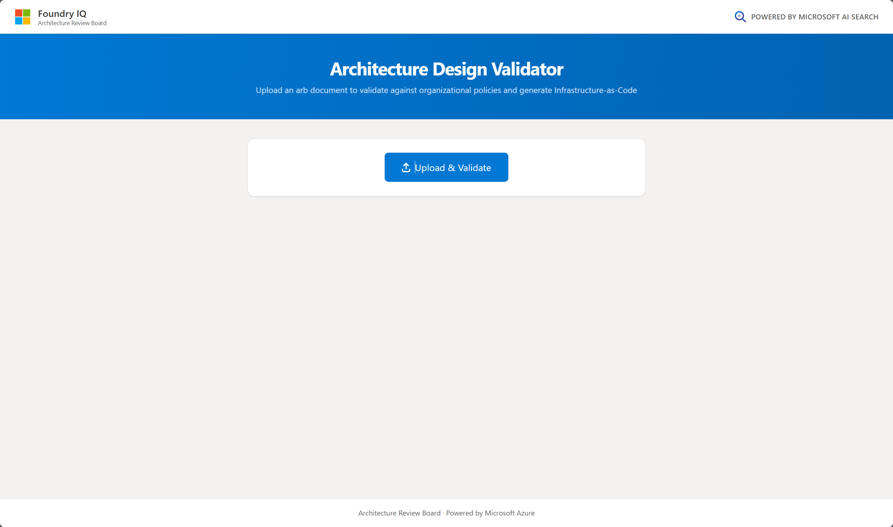

# Architecture Review Board — ARB Validator & IaC Generator

<p align="center">
  
  
  
</p>

AI-powered tool that validates Architecture Solution Design (ASD) documents against organizational cloud and security policies, and generates starter Infrastructure-as-Code (Terraform) scripts from the design content.

Built on **Microsoft Foundry v2 hosted prompt agents** invoked via the **Responses API**, with retrieval driven by the Python orchestrator against an **Azure AI Search** index (hybrid + semantic ranker). Policy ingestion uses an **Azure AI Search pull-mode pipeline** (blob → data source → skillset → index projections) where Content Understanding cracks + chunks documents, an Azure OpenAI chat skill categorizes each chunk against the canonical `PolicyCategory` taxonomy, and an Azure OpenAI embedding skill vectorizes them — all server-side, no Python push code. **All Azure access uses identity-based auth — no API keys.** An adaptive credential picker uses `AzureCliCredential` when running locally (skipping the IMDS probe to `169.254.169.254`) and `DefaultAzureCredential` inside Azure-hosted runtimes (detected via `IDENTITY_ENDPOINT` / `MSI_ENDPOINT` / `WEBSITE_INSTANCE_ID`).

## UI Preview

<p align="center">
  
</p>

## Architecture

```
┌──────────────────────┐        HTTP (REST)         ┌─────────────────────────────────────┐
│   React Front-End    │  ◄──────────────────────►  │       Flask Back-End (API)           │
│   (Vite + Tailwind)  │                            │                                      │
│                      │                            │  ┌────────────────────────────────┐  │
│  • File Upload       │                            │  │ docx/pdf parsing               │  │
│  • Validation Table  │                            │  └────────────────────────────────┘  │
│  • IaC Code Display  │                            │  ┌────────────────────────────────┐  │
└──────────────────────┘                            │  │ Orchestrator — fan-out         │  │
                                                    │  │ per (section, category)        │  │
                                                    │  └────────────────────────────────┘  │
                                                    │  ┌────────────────────────────────┐  │
                                                    │  │ search/query.py — hybrid +     │  │
                                                    │  │ semantic Azure AI Search       │  │
                                                    │  └────────────────────────────────┘  │
                                                    │  ┌────────────────────────────────┐  │
                                                    │  │ Foundry v2 hosted agents       │  │
                                                    │  │ ValidateArbAgent / IacAgent    │  │
                                                    │  │ via Responses API              │  │
                                                    │  └────────────────────────────────┘  │
                                                    └─────────────────────────────────────┘

                       Ingest pipeline (pull-mode, server-side)
                       ──────────────────────────────────────────
   ┌────────────┐    ┌────────────┐    ┌──────────────────────────────────────┐
   │ Blob       │ ─► │ Data       │ ─► │ Skillset:                            │
   │ container  │    │ source     │    │ 1. Content Understanding (chunk)     │
   │            │    │ (Managed   │    │ 2. AOAI chat (categorize)            │
   │            │    │  Identity) │    │ 3. AOAI embedding (vectorize)        │
   └────────────┘    └────────────┘    └──────────────────────────────────────┘
                                                       │
                                                       ▼
                                       ┌──────────────────────────────────────┐
                                       │ Indexer + index projections          │
                                       │ → one chunk per index doc into       │
                                       │   the arb-policies index             │
                                       └──────────────────────────────────────┘
```

### Why orchestrator-driven retrieval at validate time?

`ASD_SECTION_CATEGORIES` in [`back-end/agents/categories.py`](back-end/agents/categories.py) routes each ASD section to one or more policy categories. The orchestrator retrieves the matching policies and injects them into the prompt as a `[Retrieved Policies]` block — the agent reasons only over what it's given. See [`prompt-contracts/AGENT-SEARCH-TOOL.md`](prompt-contracts/AGENT-SEARCH-TOOL.md) for the design rationale.

### Why pull-mode for ingest?

Push-mode used to live in `search/build_index.py` and did chunking + categorization + embeddings in Python. Pull-mode moves all of that into the Search skillset where it's first-class, idempotent, observable, and cheaper at scale. The same canonical `PolicyCategory` enum is used by the AOAI categorize skill (at ingest time) and the orchestrator (at query time), so there is no taxonomy drift. See [`prompt-contracts/PULL-INDEXER-PIPELINE.md`](prompt-contracts/PULL-INDEXER-PIPELINE.md).

## Project structure

```
architecture-review-board/
├── .env                                   # repo-root env (FOUNDRY_LOCATION, MODEL, endpoints, storage…)
├── README.md
├── back-end/
│   ├── app.py                             # Flask API (/validatearb, /geniac)
│   ├── requirements.txt
│   ├── agents/
│   │   ├── orchestrator.py                # ArbWorkflow (validate + iac)
│   │   ├── validate_agent.py              # Responses-API client + retrieval
│   │   ├── iac_agent.py                   # IaC generator client
│   │   ├── categories.py                  # canonical PolicyCategory taxonomy
│   │   ├── config.py                      # env-driven Config
│   │   ├── resilience.py                  # retry + circuit breaker
│   │   └── errors.py
│   ├── search/
│   │   ├── build_indexer.py               # provisions + runs the pull-mode pipeline
│   │   ├── skillset_definition.json       # CU + AOAI categorize + AOAI embed + projections
│   │   ├── indexer_definition.json
│   │   ├── datasource_definition.json
│   │   ├── index_schema.json
│   │   ├── query.py                       # hybrid + semantic search wrapper
│   │   └── categorize.py                  # legacy keyword fallback only
│   ├── infra/
│   │   ├── provision.py                   # Foundry + Search; idempotent
│   │   ├── provision_search_pipeline.py   # storage account + container + RBAC
│   │   └── create_agents.py               # creates/updates hosted prompt agents
│   ├── file_processing/
│   │   ├── parsing.py                     # docx + pdf parsing
│   │   ├── build_azure_policies.py        # builds the sample policy docx
│   │   └── data/
│   │       ├── azure_policies.docx        # uploaded to blob; indexed by the pull pipeline
│   │       └── sample_asd.docx            # test input for the validator
│   └── tests/                             # pytest suite (mark integration for live tests)
├── front-end/                             # React 18 + TypeScript + Vite + Tailwind
├── scripts/                               # one-off helpers (pdf_to_docx, etc.)
├── prompt-contracts/                      # implementation specs (one per feature)
└── docs/
```

## Prerequisites

| Tool | Version | Notes |
|---|---|---|
| Python | 3.11+ | 3.14 tested |
| Node.js | 18+ | for the front-end |
| Azure CLI | latest | `az login` before provisioning |
| Azure subscription | — | `Cognitive Services Contributor` on the RG; `Search Service Contributor` + `Search Index Data Contributor` on the AI Search service; `Storage Account Contributor` on the storage account RG |

Supported regions for Foundry v2 hosted prompt agents (gpt-5 family): `eastus2`, `swedencentral`, `westus3`, `switzerlandnorth`, `canadaeast`, `uksouth`, and others — see [Foundry model & region support](https://learn.microsoft.com/azure/ai-foundry/agents/concepts/model-region-support). **Canada Central works at the API level** but the Foundry portal will surface an "unsupported region" warning for the new agents view; toggle to the classic portal to see them.

**Content Understanding (the CU skill) is regional too.** If your Foundry region doesn't support CU, set `FOUNDRY_CU_ENDPOINT` in `.env` to an AI Services account in a CU-supported region (Sweden Central, East US 2, West US 3 are reliable). The skillset will route CU calls there for billing while keeping chat + embeddings on the Foundry account.

## One-time setup

### 1. Clone + install

```powershell
git clone https://github.com/MTCMarkFranco/architecture-review-board.git
cd architecture-review-board
cd back-end
python -m venv venv
.\venv\Scripts\activate
pip install -r requirements.txt
cd ..\front-end
npm install
cd ..
```

### 2. Create the repo-root `.env`

```env
# Required to pick a Foundry region + model
FOUNDRY_LOCATION=canadacentral
FOUNDRY_MODEL=gpt-5.3-chat

# Subscription / tenant (az login takes care of credentials)
AZURE_SUBSCRIPTION_ID=<your-sub-id>
AZURE_TENANT_ID=<your-tenant-id>

# The rest are filled in automatically by provision.py — copy from
# back-end/.env.example after the first provision run:
# FOUNDRY_RESOURCE_GROUP=...
# FOUNDRY_ACCOUNT_NAME=...
# FOUNDRY_ENDPOINT=...
# FOUNDRY_PROJECT_NAME=...
# FOUNDRY_PROJECT_ENDPOINT=...
# FOUNDRY_MODEL_DEPLOYMENT=...
# FOUNDRY_EMBEDDINGS_DEPLOYMENT=...
# AZURE_SEARCH_ENDPOINT=...
# STORAGE_ACCOUNT_RESOURCE_ID=...
# STORAGE_CONTAINER=arb-policies-source
# Optional — set only if CU is unavailable in your Foundry region:
# FOUNDRY_CU_ENDPOINT=https://<aiservices-in-cu-region>.cognitiveservices.azure.com/
```

`provision.py`, `app.py`, and `agents/config.py` all auto-load this file via `python-dotenv` — you do **not** need to export env vars by hand.

### 3. Provision Azure resources

```powershell
az login
cd back-end
python infra\provision.py
```

Idempotent. Creates/reuses an AI Services account, chat + embeddings deployments, a Foundry v2 project, the Azure AI Search service, **and the storage account + container + RBAC needed by the pull pipeline**. RBAC roles are assigned to your signed-in user. Outputs to `back-end/.env.example` — copy the new values into the repo-root `.env`.

### 4. Provision the pull-mode indexer + run it

```powershell
cd back-end

# (a) Upload the source docx into the blob container — one-time per source doc:
az storage blob upload `
  --account-name <storage-account-from-env-example> `
  --container-name arb-policies-source `
  --name azure_policies.docx `
  --file file_processing\data\azure_policies.docx `
  --auth-mode login `
  --overwrite

# (b) Create the data source + skillset + indexer and trigger a run:
python -m search.build_indexer --run
```

`build_indexer.py` is idempotent — re-running creates-or-updates each of the three Search resources. Pass `--purge` to delete all existing index documents before ingesting (use when replacing the source doc so stale chunks are removed). Pass `--status` to view the indexer's last-run summary without re-running.

The pull pipeline:
1. **Cracks + chunks** each blob via the Content Understanding skill (`maximumLength=3500`, `overlapLength=200`).
2. **Categorizes** each chunk via an Azure OpenAI chat completion skill using `agents.categories.CATEGORIZE_SYSTEM_PROMPT`. The taxonomy is the canonical `PolicyCategory` enum — same one used by validate and IaC.
3. **Embeds** each chunk via `text-embedding-3-large` (1536 dims to match the index schema).
4. **Projects** each chunk into its own `arb-policies` index document.

⚠️ **Cost note:** CU is billed per page; AOAI chat per token (categorize prompt is ~150 tokens output max); embeddings per token. For one ~30-section policy docx this is well under $1 per full re-ingest.

### 5. Create the hosted agents

```powershell
cd back-end
python -m infra.create_agents
```

Creates `ValidateArbAgent` (prompt only — no search tool; orchestrator handles retrieval) and `IacGeneratorAgent` (code interpreter). Bumps a new version on subsequent runs.

## Daily run

**Terminal 1 — backend:**
```powershell
cd back-end
.\venv\Scripts\activate
python app.py
```
Listens on `http://127.0.0.1:5000`.

**Terminal 2 — frontend:**
```powershell
cd front-end
npm run dev
```
Opens `http://localhost:5173`. Upload an ARB doc → the UI hits `/validatearb` and `/geniac`.

## API endpoints

| Method | Path | Body | Response |
|---|---|---|---|
| POST | `/validatearb` | `multipart/form-data` field `file` (`.pdf` or `.docx`) | JSON array of finding objects |
| POST | `/geniac` | same | JSON array of Terraform script strings |

### Finding schema

```json
{
  "Type": "Violation | Deviation | Error",
  "Issue": "Brief issue title",
  "Description": "Detailed description",
  "Principles": "Policy header that was violated",
  "Mandatory": true,
  "Category": "Security and Governance"
}
```

`Category` is always one of the canonical `PolicyCategory` values (see `back-end/agents/categories.py`).

## Validation flow

1. Front-end POSTs the doc to `/validatearb`.
2. `file_processing/parsing.py` extracts sections (Network, Storage, Security, etc.).
3. `ArbWorkflow.validate` fans out (section × category) tasks driven by `ASD_SECTION_CATEGORIES`.
4. For each pair the orchestrator calls `search/query.py:search_policies` (hybrid + semantic, category-filtered) and renders the hits into a `[Retrieved Policies]` prompt block.
5. The prompt is sent to `ValidateArbAgent` through the Responses API (`project.get_openai_client(agent_name=...).responses.create(model=<deployment>, input=prompt)`).
6. JSON findings are parsed, search-failure errors are merged in, and the combined list is returned to the front-end.

## Testing

```powershell
cd back-end
pytest -q
```

Integration tests are marked `@pytest.mark.integration` and skip cleanly when the required env vars (`AZURE_SEARCH_ENDPOINT`, `FOUNDRY_ENDPOINT`, `STORAGE_ACCOUNT_RESOURCE_ID`) are missing.

## Prompt contracts

Implementation specs for each feature live in [`prompt-contracts/`](prompt-contracts/). They map 1:1 to GitHub issues and branches.

## Tech stack

| Layer | Technology |
|---|---|
| Front-end | React 18, TypeScript, Vite, Tailwind CSS |
| Back-end | Python 3.11+, Flask, Flask-CORS |
| Agents | Foundry v2 hosted prompt agents, Responses API |
| Search | Azure AI Search — hybrid + semantic ranker, HNSW vectors, pull-mode indexer (Content Understanding + AOAI categorize + AOAI embed) |
| Embeddings | `text-embedding-3-large` (Foundry deployment) |
| Storage | Azure Blob Storage (StorageV2, LRS) — source policy documents |
| Auth | `DefaultAzureCredential` end-to-end — no API keys (adaptive credential picker prefers `AzureCliCredential` locally to avoid the IMDS probe; falls back to `DefaultAzureCredential` inside Azure-hosted runtimes) |
| Document parsing | PyMuPDF (PDF), python-docx |
| Resilience | retry-with-backoff + circuit breaker (`agents/resilience.py`) |

## Roadmap

- [x] Migrate Semantic Kernel → Foundry v2 hosted agents
- [x] Orchestrator-driven retrieval (was: built-in AI Search agent tool)
- [x] `DefaultAzureCredential` everywhere
- [x] Pull-mode indexer (CU + AOAI categorize + AOAI embed)
- [x] Canonical `PolicyCategory` taxonomy
- [ ] Tune `WORKFLOW_TIMEOUT_SECONDS` / fan-out concurrency for full-document runs
- [ ] Promote prompt contracts into a release gate (CI check)
- [ ] Wire OpenTelemetry → Agent 365 (see issue #60)

## License

Internal use. See your organization's licensing policy.
